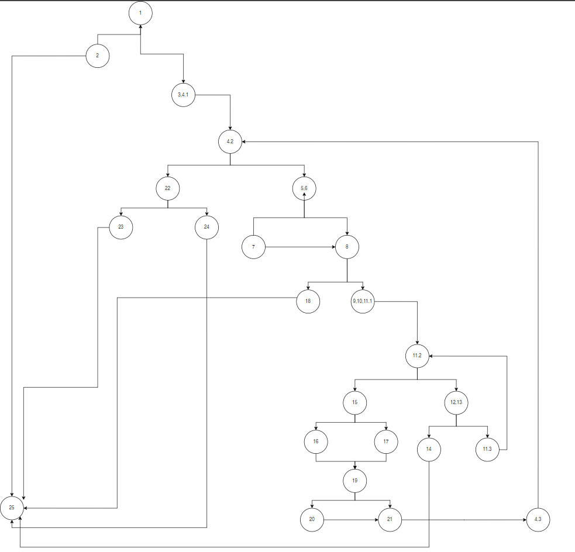
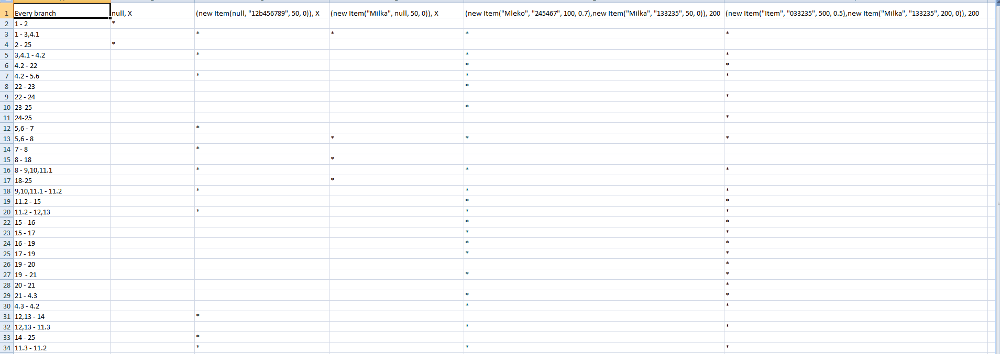
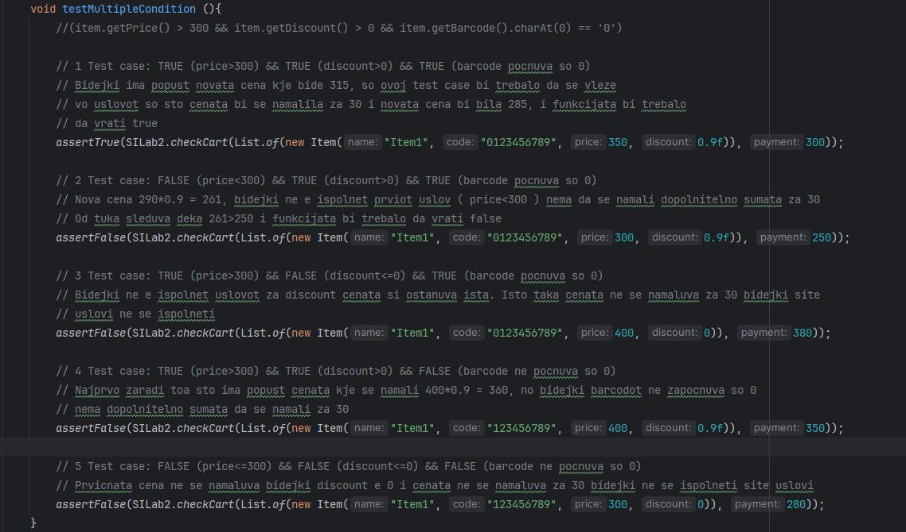

Втора лабораториска вежба по Софтверско инженерство

Андреј Велков, бр. на индекс 225126

2) Control Flow Graph:

3) Цикломатска комплексност
- Добив дека цикломатската комплексност е 10 преку формулата: **број_ребра - број_јазли + 2**
- Во мојот случај бројот на ребра е 32, додека бројот на јазли е 24, па одтаму **32-24+2=10**
- Исто така може да се пресмета со бројот на услови и бројот на циклуси + 1 што исто така дава резултат 10
4) Every branch

 - Потребни се 5 test-cases за да се поминат сите возможни сценарија. Секој test-case е објаснет со коментари во SLab2Test.
5) Multiple condition
- Напишав тестови за сите можни комбинации на условот

